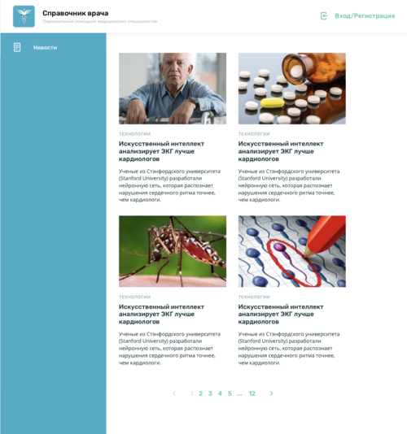
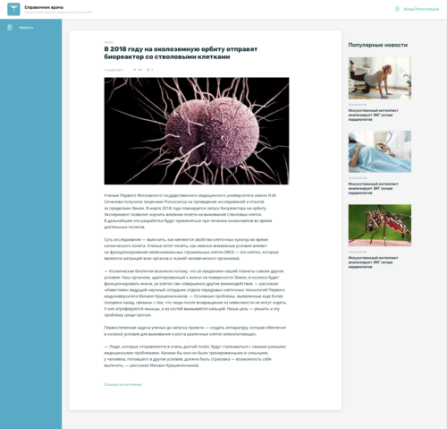

Тестовое задание

Задача:
* Разработать PWA приложение, для отображения новостей. 

В тестовом приложении предусмотрено:
* Страница со списком новостей (рис-1):

* Страница с конкретной новостью (рис-2).  

На экране со списком новостей (рис.1) необходимо отобразить карточки новостей:
* превью изображения; 
* заголовок категорию и дату публикации.
* новости необходимо подгружать постранично. 

На экране конкретной новости (рис.2) требуется вывести:
* текст новости; 
* изображение;
* категорию, дату публикации;
* ссылку на источник публикации;
* список похожих новостей.

Требования к приложению:
* реализовать на Angular2+;
* использовать паттерн управления состоянием NgXs или Akita;
* для верстки в проекте использовать (Less или Sass), БЭМ. 

Материалы для выполнения задания:
* адрес сервера REST API: https://medicapp.k8s.mhth.ru/
* [документация к REST API](https://htmlpreview.github.io/?https://github.com/medsolutions/angular_test/blob/master/api/api.html)
* [материалы по дизайну](https://github.com/medsolutions/angular_test/raw/master/design/src.zip)
* ссылка на styleguide в Zeplin https://scene.zeplin.io/project/5db190e70e4ae822c2f356b3

